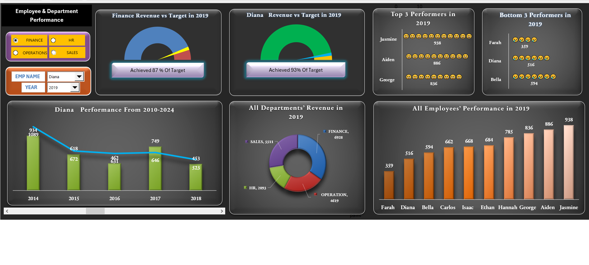

# 📊 Employee & Department-wise Performance Dashboard (Excel)

This Excel-based dashboard provides a detailed view of employee and department-wise performance from 2010 to 2024. It helps managers and HR teams evaluate performance trends, compare actual revenue vs targets, and identify top and bottom performers with just a few clicks.

---

## 🔍 Key Features

- 🎯 **Department-wise Filtering** (Finance, Sales, Operations, HR)
- 📅 **Employee & Year Selection** via Slicers
- 📈 **Performance Trends (2010–2024)** for each employee
- 🎯 **Revenue vs Target Gauge**
- 🏆 **Top 3 & Bottom 3 Performers** in selected year
- 📊 **Department-wise Revenue Breakdown**
- 🧑‍💼 **All Employees Comparison** in selected year

---

## 🧰 Built With

- Microsoft Excel  
- Pivot Tables & Pivot Charts  
- Slicers & Interactive Filters
- Formulas & Functions 
- Conditional Formatting  
- Develpoer Tab tools

---

## 📷 Dashboard Preview

---

## 📄 Download Full Report (PDF)

[Click here to view/download the full PDF](./emp_dep_insights.pdf)

---

## 🧠 Use Case

This dashboard is ideal for:
- HR performance reviews  
- Department-wise target tracking  
- Yearly performance appraisal  
- Strategic decision-making for workforce planning

---

## 👤 Created By

**Vikrant Ghale**  

